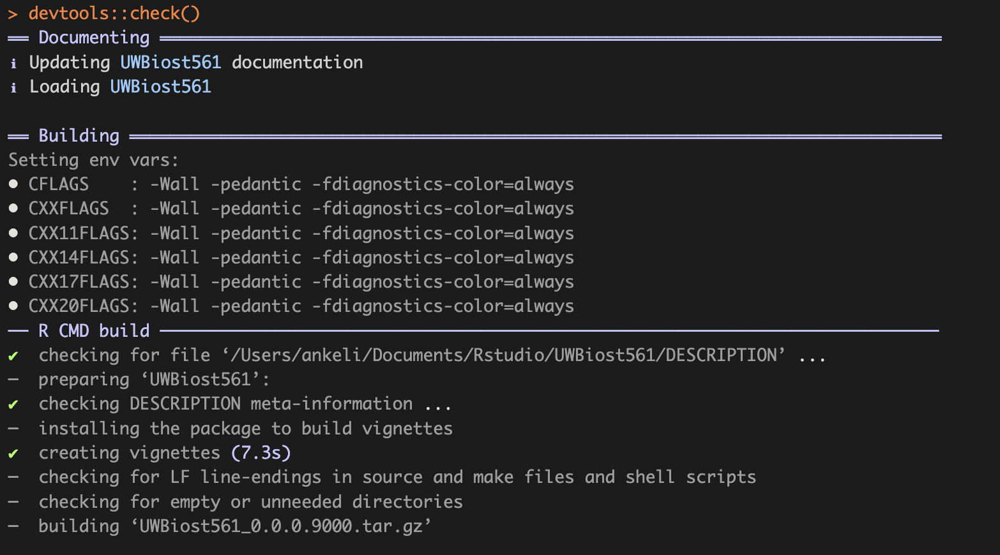
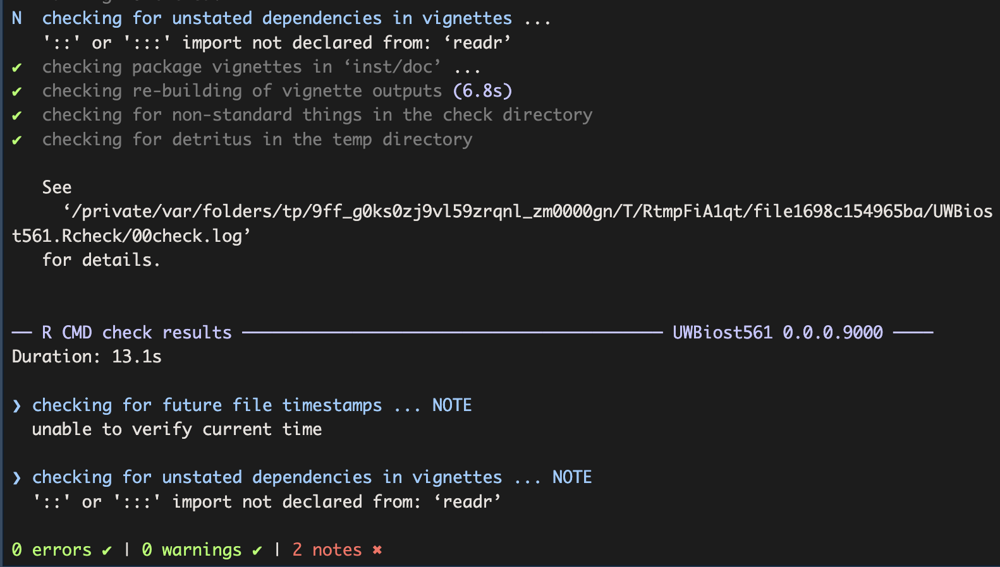

### Question 1D
```{r}
library(UWBiost561)
set.seed(0)
simulation <- UWBiost561::generate_partial_clique(
  n = 10,
  clique_fraction = 0.5,
  clique_edge_density = 0.9
)

simulation$adj_mat


```


### Question 2C
```{r}

library(UWBiost561)
set.seed(0)
simulation <- UWBiost561::generate_partial_clique(
  n = 10,
  clique_fraction = 0.5,
  clique_edge_density = 0.9
)

adj_mat <- simulation$adj_mat

res <- UWBiost561::compute_maximal_partial_clique(
  adj_mat = adj_mat,
  alpha = 0.9
)
res
```


### Question 4C
```{r}



devtools::session_info()

```


### Question 5B
I'm still exploring possible topics. One idea is to build on the UWBiost561 package and extend it with new simulations or data visualization tools.
