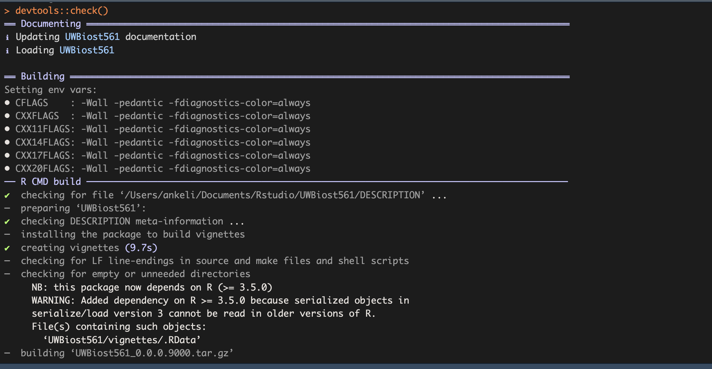
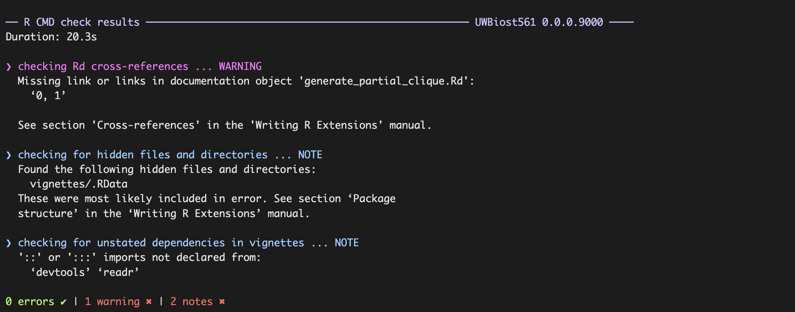
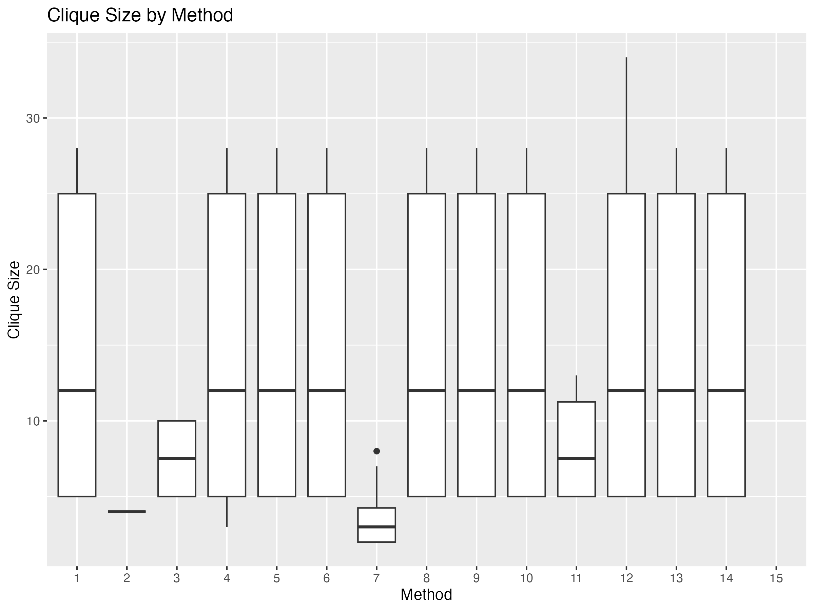

```{r}

```

#### Q1A:

#### Q1B:

##### Implementation #12 (`compute_maximal_partial_clique12()`):

-   The function starts by checking all input requirements for the adjacency matrix and the density threshold.
-   For each node, it constructs a clique by including the node and its direct connections, then greedily removes nodes until the clique's edge density meets the alpha threshold.
-   It tries to expand the clique further by including additional nodes and checks if the expanded set achieves the required density.
-   The function keeps track of the largest clique found that satisfies the density requirement and returns its node indices and density.

##### Implementation #13 (`compute_maximal_partial_clique13()`):

-   The function first validates the adjacency matrix and alpha value.
-   It begins with all nodes as the starting set and calculates the current edge density.
-   It then iteratively removes the node whose removal results in the highest edge density, stopping when the density requirement is reached or only one node remains.
-   The function returns the final set of node indices (the maximal partial clique) and its edge density.

#### Q1C:

##### Implementation #12:

-   The code would benefit from more comments explaining key steps, especially the logic in the clique expansion and redundancy checking.
-   Variable names like `ran_clique` and helper functions such as `calculate_density_12` could use more descriptive names or inline documentation for clarity.

##### Implementation #13:

-   The code is well-structured and uses clear variable names.
-   Additional comments could be added to the greedy-removal loop to help the reader follow the iterative process, but overall, the code is quite readable.

#### Q1D: Unit tests for assigned implementations

Below, I run my five unit tests for both `compute_maximal_partial_clique12()` and `compute_maximal_partial_clique13()`.

```{r test12, error=TRUE,echo=TRUE}
library(testthat)
# Test 1
test_that("output list contains clique_idx and edge_density", {
  set.seed(1)
  adj <- generate_partial_clique(10, 0.5, 0.9)$adj_mat
  res <- compute_maximal_partial_clique12(adj, alpha = 0.8)
  expect_named(res, c("clique_idx", "edge_density"))
})

# Test 2
test_that("clique_idx values are valid node indices", {
  set.seed(2)
  adj <- generate_partial_clique(12, 0.5, 0.9)$adj_mat
  res <- compute_maximal_partial_clique12(adj, alpha = 0.8)
  expect_true(all(res$clique_idx %% 1 == 0))
  expect_true(all(res$clique_idx >= 1 & res$clique_idx <= nrow(adj)))
})

# Test 3
test_that("edge density is >= alpha", {
  set.seed(3)
  adj <- generate_partial_clique(10, 0.5, 0.9)$adj_mat
  res <- compute_maximal_partial_clique12(adj, alpha = 0.85)
  expect_true(res$edge_density >= 0.85)
})

# Test 4
test_that("function errors with bad adj_mat input", {
  bad_mat <- matrix(runif(25), nrow = 5)
  diag(bad_mat) <- 1
  expect_error(compute_maximal_partial_clique12(bad_mat, 0.9))
})

# Test 5
test_that("function errors if alpha is out of bounds", {
  adj <- generate_partial_clique(10, 0.5, 0.9)$adj_mat
  expect_error(compute_maximal_partial_clique12(adj, alpha = 1.5))
})

```

#### Q2A:

```{r test13, error=TRUE,echo=TRUE}
library(testthat)
# Test 1
test_that("output list contains clique_idx and edge_density", {
  set.seed(1)
  adj <- generate_partial_clique(10, 0.5, 0.9)$adj_mat
  res <- compute_maximal_partial_clique13(adj, alpha = 0.8)
  expect_named(res, c("clique_idx", "edge_density"))
})

# Test 2
test_that("clique_idx values are valid node indices", {
  set.seed(2)
  adj <- generate_partial_clique(12, 0.5, 0.9)$adj_mat
  res <- compute_maximal_partial_clique13(adj, alpha = 0.8)
  expect_true(all(res$clique_idx %% 1 == 0))
  expect_true(all(res$clique_idx >= 1 & res$clique_idx <= nrow(adj)))
})

# Test 3
test_that("edge density is >= alpha", {
  set.seed(3)
  adj <- generate_partial_clique(10, 0.5, 0.9)$adj_mat
  res <- compute_maximal_partial_clique13(adj, alpha = 0.85)
  expect_true(res$edge_density >= 0.85)
})

# Test 4
test_that("function errors with bad adj_mat input", {
  bad_mat <- matrix(runif(25), nrow = 5)
  diag(bad_mat) <- 1
  expect_error(compute_maximal_partial_clique13(bad_mat, 0.9))
})

# Test 5
test_that("function errors if alpha is out of bounds", {
  adj <- generate_partial_clique(10, 0.5, 0.9)$adj_mat
  expect_error(compute_maximal_partial_clique13(adj, alpha = 1.5))
})
```

```{r, echo=TRUE}
library(UWBiost561)
set.seed(10)
data <- UWBiost561::generate_partial_clique(n = 10, 
                                            clique_fraction = 0.5,
                                            clique_edge_density = 0.95)

set.seed(10)
result1 <- UWBiost561::compute_maximal_partial_clique_master(
  adj_mat = data$adj_mat, 
  alpha = 0.95, 
  number = 11, 
  time_limit = 30
)
result1

set.seed(10)
result2 <- UWBiost561::compute_maximal_partial_clique11(
  adj_mat = data$adj_mat, 
  alpha = 0.95
)
result2

```

```{r, echo=TRUE}
set.seed(123)
data <- UWBiost561::generate_partial_clique(n = 48, clique_fraction = 0.7, clique_edge_density = 0.85)
result <- UWBiost561::compute_maximal_partial_clique_master(
  adj_mat = data$adj_mat, 
  alpha = 0.85, 
  number = 12,   
  time_limit = 1 
)
result

```

#### Q2B:

The goal of my simulation study is to compare the performance of all 15 `compute_maximal_partial_clique` implementations on synthetic random graphs generated by `generate_partial_clique()`.

-   **Random Graph Generation:**\
    I will use the `generate_partial_clique()` function to generate adjacency matrices. Each graph has n nodes, with a subset of nodes forming a partial clique of specified density. The remaining edges are filled randomly. The main parameters to control are `n` (number of nodes), `clique_fraction` (fraction of nodes in the planted clique), and `clique_edge_density` (density within the clique).

-   **Varying the Levels:**\
    My simulation study will consider at least two different levels. For example, I will vary:

    -   **Number of nodes (`n`):** I will use values such as 10, 25, and 50.
    -   **Alpha (`alpha`):** I will use values such as 0.7 and 0.9. For each level, I will keep the other parameters fixed or set to reasonable values (e.g., `clique_fraction = 0.5`, `clique_edge_density = 0.9`).

-   **Methods Compared:**\
    All 15 implementations (`compute_maximal_partial_clique1` through `compute_maximal_partial_clique15`) will be applied to each generated graph via `compute_maximal_partial_clique_master()`.

-   **Quantities Tracked:**\
    For each run, I will record whether the implementation timed out, the size of the clique found, the correct edge density (using `compute_correct_density()`), and the running time.

-   **Aims and Expected Trends:**\
    I hope to observe how the different implementations compare in terms of:

    -   Success rate (proportion of trials that do not time out)
    -   Accuracy (finding a valid clique with density ≥ alpha)
    -   Clique size (are some methods more likely to find larger partial cliques?)
    -   Speed (time to solution) I am especially interested in how performance varies with `n` and `alpha`, and whether any methods consistently outperform others.

-   **Number of Trials:**\
    For each combination of parameters (level), I plan to run at least 2–5 trials to account for random variation.

-   **Estimated Total Time:**\
    With 3 values of `n`, 2 values of `alpha`, 5 trials per level, and 15 methods, there will be 3 × 2 × 5 × 15 = 450 runs. With a max time limit of 30 seconds per run, the worst-case total is 3.75 hours. In practice, most runs should finish much faster.

#### Q2C:

#### Q2D:

#### Q2E:

```{r, echo=TRUE}



#devtools::session_info()

```

#### Q3:

```{r fig.hw4, echo=FALSE, out.width="80%"}


```

#### Q4:

For my final project, I plan to build a PkgDown website for my UWBiost561 R package, which includes functions for generating random graphs with planted partial cliques, computing maximal partial cliques, and running simulation studies.
